<!--
  Oh, you opened the source. Curious mind, I like you.
  Kaynağa bakmışsın. Meraklı insanları severim.

  Secret badge / Gizli rozet: 🔍 Source Reader
  (Nobody will believe you anyway. / Kimse inanmayacak zaten.)
-->

<p align="center">
  
</p>

<p align="center">
  
  
  
  
</p>

<p align="center">
  
</p>

<h3 align="center">🧰 Toolbox</h3>

<p align="center">
  
</p>

<p align="center">
  <b>AI / ML</b><br/>
  
  
  
  
  
  
  
  <br/><br/>
  <b>LLM apps</b><br/>
  
  
  
  
  
  
  <br/><br/>
  <b>Infra</b><br/>
  
  
  
  
  
  
  <br/><br/>
  <b>Homelab & hardware</b><br/>
  
  
  
  
</p>

<br/>

<h3 align="center">🌍 Pick your language · Dilini seç</h3>

<details>
<summary><b>🇬🇧 English</b> <sub>(click to open)</sub></summary>
<br/>



### 👋 About me

- I'm a computer engineer who likes keeping big GPUs busy and small drones in the air.
- **Days:** serving LLMs, building RAG pipelines, teaching cameras to see things, wrestling with Kubernetes.
- **Nights:** 3D printing parts I don't need yet, tinkering with my homelab, reading Karpathy's code like a novel.
- **Balcony:** a potted lemon tree with better uptime than most servers.
- **Repos:** private. So I built you a playground instead 👇

### 🎮 Mini adventure

<p><i>You wake up in a dark room. Fans are humming somewhere. Three doors glow in front of you.</i></p>

<details>
<summary>🚪 <b>Door 1:</b> The server room <sub>(it's cold in there)</sub></summary>
<blockquote>
It's 18°C and very loud. A monitor blinks red:<br/>
<code>RuntimeError: CUDA out of memory.</code><br/>
What do you do?
<details>
<summary>💸 Ask for more GPUs</summary>
<blockquote>The purchase form is 14 pages long. You are still filling it in.<br/><b>GAME OVER</b> 🔁 Try another option.</blockquote>
</details>
<details>
<summary>📉 Lower the batch size</summary>
<blockquote>It runs! But now it's slooow...
<details>
<summary>⚡ Quantize to 4-bit</summary>
<blockquote>It fits and it's fast. The answers are 1% dumber and nobody notices.<br/>🏆 <b>Badge unlocked: GPU Whisperer</b></blockquote>
</details>
<details>
<summary>🧪 Write a custom kernel</summary>
<blockquote>Three days later it's 11% faster. Worth it? Absolutely.<br/>🥷 <b>Badge unlocked: Kernel Ninja</b></blockquote>
</details>
</blockquote>
</details>
<details>
<summary>🔌 Turn it off and on again</summary>
<blockquote><code>kubectl rollout restart</code> ... all pods Running. It's not a fix. But it's not <i>not</i> a fix.<br/>😌 <b>Badge unlocked: Have You Tried</b></blockquote>
</details>
</blockquote>
</details>

<details>
<summary>🛩️ <b>Door 2:</b> The hangar <sub>(smells like solder)</sub></summary>
<blockquote>
A quadcopter sits on the bench. Batteries charged, props on, the sky looks perfect.
<details>
<summary>🚀 Fly it right now</summary>
<blockquote>It takes off, does a surprise backflip and lands in the lemon tree. The tree is fine. Your pride is not.<br/><b>GAME OVER</b> 🔁</blockquote>
</details>
<details>
<summary>🧭 Calibrate the compass and check the failsafe first</summary>
<blockquote>Smooth takeoff, clean telemetry. From 100 m up you spot something blinking on a roof...
<details>
<summary>🔭 Zoom in with the camera</summary>
<blockquote>It's a sticky note: <i>"Did you commit your code?"</i><br/>🛩️ <b>Badge unlocked: Safe Pilot</b></blockquote>
</details>
<details>
<summary>🔋 Battery at 30%, return home</summary>
<blockquote>Wise choice. Perfect landing, nobody claps. That's how you know it was a good one.<br/>🛩️ <b>Badge unlocked: Safe Pilot</b></blockquote>
</details>
</blockquote>
</details>
</blockquote>
</details>

<details>
<summary>🍋 <b>Door 3:</b> The balcony <sub>(something smells fresh)</sub></summary>
<blockquote>
A potted lemon tree looks at you. It looks thirsty.
<details>
<summary>💧 Water it</summary>
<blockquote>The tree is happy. A tiny lemon drops into your hand.<br/>When life gives you lemons... fine-tune on them.<br/>🍋 <b>Badge unlocked: Lemon Keeper</b></blockquote>
</details>
<details>
<summary>📊 Build a monitoring dashboard for it first</summary>
<blockquote>Beautiful panels. Soil moisture: 3%. The tree is now fully observable and still thirsty.<br/><b>GAME OVER</b> 🔁 Go back and just water it.</blockquote>
</details>
</blockquote>
</details>

<details>
<summary>🕳️ <sub>(there is no door 4)</sub></summary>
<blockquote>You found the secret library. The shelves are full of Karpathy repos: micrograd, nanoGPT, llm.c...<br/>You read one line of backprop and suddenly understand everything. For about five minutes.<br/>📜 <b>Badge unlocked: Backprop Scholar</b></blockquote>
</details>

<p><sub>🏆 GPU Whisperer · 🥷 Kernel Ninja · 😌 Have You Tried · 🛩️ Safe Pilot · 🍋 Lemon Keeper · 📜 Backprop Scholar<br/>Got them all? You have officially spent more time here than I spent on my weekend.</sub></p>

### 🧩 Quiz time

<details>
<summary>🧠 <b>Riddle:</b> I have keys and values, but I'm not a database. I have queries, but I don't speak SQL. What am I?</summary>
<blockquote><b>Attention!</b> The mechanism, not your phone notifications.</blockquote>
</details>

<details>
<summary>🔤 <b>Emoji puzzle:</b> guess the tech</summary>
<blockquote>
<details><summary>🐍 + 🔥</summary>PyTorch</details>
<details><summary>🦙 + 📇</summary>LlamaIndex</details>
<details><summary>👀 × 1</summary>YOLO (You Only Look Once)</details>
<details><summary>☸️ + 🐳🐳🐳</summary>Kubernetes, herding containers</details>
<details><summary>🐂</summary>Longhorn. Yes, it's a storage system. No, it doesn't moo.</details>
</blockquote>
</details>

<details>
<summary>🎴 <b>Pokémon or infra tool?</b></summary>
<blockquote>
<details><summary>Onix</summary>Pokémon 🪨 (the tool is <b>ONNX</b>, gotcha)</details>
<details><summary>Qdrant</summary>Tool. A vector database. Sounds like a Pokémon though.</details>
<details><summary>Rhydon</summary>Pokémon 🦏</details>
<details><summary>Envoy</summary>Tool. A proxy that routes your traffic.</details>
<details><summary>Vulpix</summary>Pokémon 🦊</details>
<details><summary>Argo</summary>Tool. GitOps, it deploys stuff for you.</details>
</blockquote>
</details>

<details>
<summary>🐛 <b>Find the bug</b></summary>
<br/>

```python
def is_weekend(day: str) -> bool:
    return day in ("Saturday", "Sunday")
```

<blockquote>It assumes engineers have weekends. 🙃</blockquote>
</details>

<details>
<summary>🎲 <b>Two truths and a lie</b></summary>
<blockquote>
1. I have a potted lemon tree.<br/>
2. I build drones.<br/>
3. I have never seen a CUDA OOM error.
<details><summary>Show the lie</summary><b>#3.</b> We see each other every day. We're basically roommates.</details>
</blockquote>
</details>

</details>

<details>
<summary><b>🇹🇷 Türkçe</b> <sub>(açmak için tıkla)</sub></summary>
<br/>


### 👋 Hakkımda

- Büyük GPU'ları meşgul, küçük drone'ları havada tutmayı seven bir bilgisayar mühendisiyim.
- **Gündüzleri:** LLM servis ediyorum, RAG pipeline'ları kuruyorum, kameralara bir şeyler görmeyi öğretiyorum, Kubernetes'le güreşiyorum.
- **Geceleri:** henüz ihtiyacım olmayan parçaları 3D yazıcıdan basıyorum, homelab'ı kurcalıyorum, Karpathy'nin kodunu roman gibi okuyorum.
- **Balkonda:** uptime konusunda çoğu sunucudan iyi olan, saksıda bir limon ağacı.
- **Repolarım:** private. Ben de sana bir oyun alanı yaptım 👇

### 🎮 Mini macera

<p><i>Karanlık bir odada uyanıyorsun. Bir yerlerde fanlar uğulduyor. Önünde üç kapı parlıyor.</i></p>

<details>
<summary>🚪 <b>1. Kapı:</b> Sunucu odası <sub>(içerisi soğuk)</sub></summary>
<blockquote>
Hava 18°C ve çok gürültülü. Bir monitör kırmızı yanıp sönüyor:<br/>
<code>RuntimeError: CUDA out of memory.</code><br/>
Ne yaparsın?
<details>
<summary>💸 Daha fazla GPU iste</summary>
<blockquote>Satın alma formu 14 sayfa. Hâlâ dolduruyorsun.<br/><b>OYUN BİTTİ</b> 🔁 Başka bir seçenek dene.</blockquote>
</details>
<details>
<summary>📉 Batch size'ı düşür</summary>
<blockquote>Çalıştı! Ama şimdi çok yavaaaş...
<details>
<summary>⚡ 4-bit'e quantize et</summary>
<blockquote>Sığdı, hızlı da. Cevaplar %1 daha saf ama kimse fark etmiyor.<br/>🏆 <b>Rozet açıldı: GPU Terbiyecisi</b></blockquote>
</details>
<details>
<summary>🧪 Kendi kernel'ını yaz</summary>
<blockquote>Üç gün sonra %11 daha hızlı. Değdi mi? Kesinlikle.<br/>🥷 <b>Rozet açıldı: Kernel Ninja</b></blockquote>
</details>
</blockquote>
</details>
<details>
<summary>🔌 Kapatıp aç</summary>
<blockquote><code>kubectl rollout restart</code> ... tüm pod'lar Running. Çözüm değil. Ama çözüm <i>değil</i> de değil.<br/>😌 <b>Rozet açıldı: Kapatıp Açtın mı?</b></blockquote>
</details>
</blockquote>
</details>

<details>
<summary>🛩️ <b>2. Kapı:</b> Hangar <sub>(lehim kokuyor)</sub></summary>
<blockquote>
Tezgâhta bir quadcopter duruyor. Bataryalar dolu, pervaneler takılı, hava mükemmel.
<details>
<summary>🚀 Hemen uçur</summary>
<blockquote>Kalkıyor, sürpriz bir ters takla atıyor ve limon ağacına konuyor. Ağaç iyi. Gururun pek değil.<br/><b>OYUN BİTTİ</b> 🔁</blockquote>
</details>
<details>
<summary>🧭 Önce pusulayı kalibre et, failsafe'i kontrol et</summary>
<blockquote>Pürüzsüz kalkış, tertemiz telemetri. 100 metreden bir çatıda yanıp sönen bir şey görüyorsun...
<details>
<summary>🔭 Kamerayla yakınlaş</summary>
<blockquote>Bir post-it: <i>"Kodunu commit ettin mi?"</i><br/>🛩️ <b>Rozet açıldı: Güvenli Pilot</b></blockquote>
</details>
<details>
<summary>🔋 Batarya %30, eve dön</summary>
<blockquote>Akıllıca. İniş kusursuz, kimse alkışlamıyor. İyi iniş böyle anlaşılır.<br/>🛩️ <b>Rozet açıldı: Güvenli Pilot</b></blockquote>
</details>
</blockquote>
</details>
</blockquote>
</details>

<details>
<summary>🍋 <b>3. Kapı:</b> Balkon <sub>(taze bir koku var)</sub></summary>
<blockquote>
Saksıdaki limon ağacı sana bakıyor. Susamış gibi.
<details>
<summary>💧 Sula</summary>
<blockquote>Ağaç mutlu. Avucuna minik bir limon düşüyor.<br/>Hayat sana limon verirse... onunla fine-tune yap.<br/>🍋 <b>Rozet açıldı: Limon Bekçisi</b></blockquote>
</details>
<details>
<summary>📊 Önce ona bir monitoring dashboard'u kur</summary>
<blockquote>Paneller harika. Toprak nemi: %3. Ağaç artık tamamen gözlemlenebilir ve hâlâ susuz.<br/><b>OYUN BİTTİ</b> 🔁 Geri dön ve sadece sula.</blockquote>
</details>
</blockquote>
</details>

<details>
<summary>🕳️ <sub>(4. kapı yok)</sub></summary>
<blockquote>Gizli kütüphaneyi buldun. Raflar Karpathy repolarıyla dolu: micrograd, nanoGPT, llm.c...<br/>Backprop'un tek bir satırını okuyorsun ve her şeyi anlıyorsun. Yaklaşık beş dakikalığına.<br/>📜 <b>Rozet açıldı: Backprop Âlimi</b></blockquote>
</details>

<p><sub>🏆 GPU Terbiyecisi · 🥷 Kernel Ninja · 😌 Kapatıp Açtın mı? · 🛩️ Güvenli Pilot · 🍋 Limon Bekçisi · 📜 Backprop Âlimi<br/>Hepsini topladın mı? Resmen burada benim hafta sonumdan fazla vakit geçirdin.</sub></p>

### 🧩 Bulmaca köşesi

<details>
<summary>🧠 <b>Bilmece:</b> Anahtarlarım ve değerlerim var ama veritabanı değilim. Sorgularım var ama SQL bilmem. Ben neyim?</summary>
<blockquote><b>Attention!</b> Mekanizma olan, telefon bildirimlerin değil.</blockquote>
</details>

<details>
<summary>🔤 <b>Emoji bulmacası:</b> teknolojiyi tahmin et</summary>
<blockquote>
<details><summary>🐍 + 🔥</summary>PyTorch</details>
<details><summary>🦙 + 📇</summary>LlamaIndex</details>
<details><summary>👀 × 1</summary>YOLO (You Only Look Once, sadece bir kez bakarsın)</details>
<details><summary>☸️ + 🐳🐳🐳</summary>Kubernetes, container çobanlığı</details>
<details><summary>🐂</summary>Longhorn. Evet, bir depolama sistemi. Hayır, böğürmüyor.</details>
</blockquote>
</details>

<details>
<summary>🎴 <b>Pokémon mu, altyapı aracı mı?</b></summary>
<blockquote>
<details><summary>Onix</summary>Pokémon 🪨 (araç olanı <b>ONNX</b>, yakaladım seni)</details>
<details><summary>Qdrant</summary>Araç. Vektör veritabanı. Ama Pokémon gibi duruyor, kabul.</details>
<details><summary>Rhydon</summary>Pokémon 🦏</details>
<details><summary>Envoy</summary>Araç. Trafiğini yönlendiren bir proxy.</details>
<details><summary>Vulpix</summary>Pokémon 🦊</details>
<details><summary>Argo</summary>Araç. GitOps, senin yerine deploy ediyor.</details>
</blockquote>
</details>

<details>
<summary>🐛 <b>Bug'ı bul</b></summary>
<br/>

```python
def hafta_sonu_mu(gun: str) -> bool:
    return gun in ("Cumartesi", "Pazar")
```

<blockquote>Mühendislerin hafta sonu olduğunu varsayıyor. 🙃</blockquote>
</details>

<details>
<summary>🎲 <b>İki doğru bir yalan</b></summary>
<blockquote>
1. Saksıda bir limon ağacım var.<br/>
2. Drone yapıyorum.<br/>
3. Hiç CUDA OOM hatası görmedim.
<details><summary>Yalanı göster</summary><b>3. madde.</b> Her gün görüşüyoruz. Ev arkadaşı gibiyiz artık.</details>
</blockquote>
</details>

</details>

<br/>

<h3 align="center">🐍 Contribution graph, served as a snack · Katkı grafiğim, yılana yem</h3>

<p align="center">
  <picture>
    <source media="(prefers-color-scheme: dark)" srcset="https://raw.githubusercontent.com/hasanbozok/hasanbozok/output/github-snake-dark.svg" />
    <source media="(prefers-color-scheme: light)" srcset="https://raw.githubusercontent.com/hasanbozok/hasanbozok/output/github-snake.svg" />
    
  </picture>
</p>

<p align="center">
  <sub>Made with too many GPUs and one lemon tree 🍋 · Uğradığın için sağ ol!</sub>
</p>
